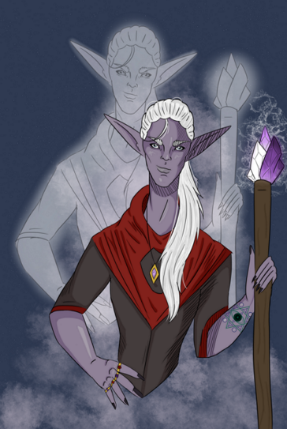
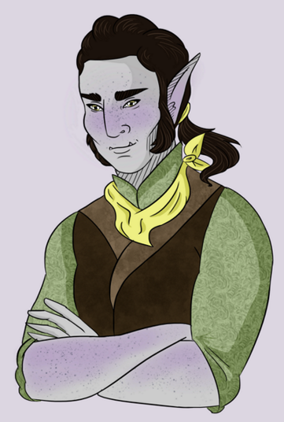
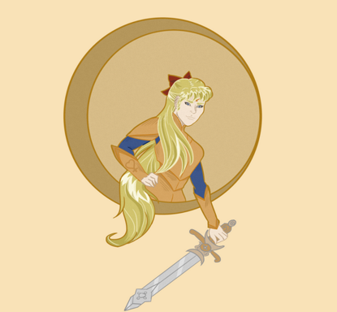

## Homework 1  
The goal of this assignment was to get familiar with git, HTML, Bootstrap, and CSS. To do, we
installed and got familiar with various programs and basic web design building by making
a simple webpage to showcase these skills. Through this assignment, I have learned the basics 
of HTML and CSS. 

### Links
[Home](https://siphry.github.io)  
[HW1 Demo](https://siphry.github.io/HW1/HTML/home.html)

### Step 1 [Setup]  
I already had a GitHub account set up from my summer internship at University of Connecticut, but I had not worked with it via a bash or command line. I downloaded and installed Git, Bootstrap, and Visual Studio Code, and enabled the necessary plugins for Visual Studio for both this assignment and future assignments. I set up folders on both my Surface and my home PC so I can switch between working at home and working on campus. I will keep each assignment in it’s own folder separately within a main CS460 folder. 

First I added an empty README through GitHub's website, then created and organized all my folders via Visual Studio Code. While all my folder and file organization is done via
Visual, all updates to my repository are done from Git Bash. I set up the bash by following the tutorial from [Don't be Afraid to Commit](https://dont-be-afraid-to-commit.readthedocs.io/en/latest/git/commandlinegit.html):

```
git config --global user.name “siphry”
git config --global user.email “stacia.i.fry@gmail.com”
```

### Step 2 [Setup]
To add my files or changes made through Visual, I follow this base cycle of commands in the bash:

```
git add . 
git status
git commit -m "commit message here"
git push origin [branch]
```
I use `add .` because I am usually altering multiple files at a time and don't want to miss anything. Then I check the status just to make sure things are looking good.
I make a multiple commits because I like to check to make sure the alterations I am making actually work properly before I write a ton of code, in case I am incorrect.

Unfortunately, I switch between my surface and my pc a lot. Originally I was using two branches separately depending on where I was working, but then it got messy moving things
to the master branch...but I often forget to pull first after switching machines so I run into the mess of my commits not lining up.

### Step 3 [Content/Coding]
Once the basics were complete, I jumped right into making the website since I wanted to get that part done completely before moving on to writing my blog.
I used [W3Schools](https://www.w3schools.com/bootstrap4/default.asp) for help on bootstrap and css styling. Here is a sample code of my navbar using bootstrap.

##### Bootstrap Navbar
```html
<nav class="navbar navbar-expand-sm navbar-custom">
    <ul class="navbar-nav">
        <li class="nav-item">
            <a class="nav-link active" href="../HTML/home.html">Home</a>
        </li>
        <li class="nav-item">
            <a class="nav-link" href="../HTML/link1.html">Art</a>
        </li>
        <li class="nav-item">
            <a class="nav-link" href="../HTML/link2.html">Commission</a>
        </li>
    </ul>
</nav>
```

I customized my navbar by creating a new class `navbar-custom` so I could have a navigation bar with colors that matched the rest of the webpage.

##### Columns and Lists (DL and UL)
I decided to combine the columns and lists requirments onto the same page by place two different list styles into two columns.
I used the description list and the unordered lists for these examples. Since my website was built around my art portfolio, I used the DL to 
list and describe my completed commissions and their costs, while the UL simply lists a art series I did over the summer.

```html
<h3>D&D Commission Examples and Sailor Moon Series</h3>
    <div class="col-xl-6">
        <dl>
            <dt>Female Half-Orc</dt>
            <dd>My first commission, headshot, $75</dd>
            <dd> </dd>
            <dt>Male Tielfing</dt>
            <dd>Bust, $50
            <dd></dd>
            <dt>Male Aasimar</dt>
            <dd>Bust, gift for friend
            <dd></dd>
            <dt>Male Half-Orc</dt>
            <dd>Bust, gift for friend
            <dd></dd>
        </dl>
                  
    </div>
               
    <div class="col-xl-6">
        <div class="list">
            <ul class="list2">
            <li>Sailor Moon x Dungeons and Dragons</li>
            <li>Sailor Moon the Cleric</li>
            
            <li>Sailor Mercury the Wizard</li>
            
            <li>Sailor Mars the Ranger</li>
            
            <li>Sailor Jupiter the Druid</li>
            
            <li>Sailor Venus the Fighter</li>
            
            </ul>
        </div>
    </div>  
```

I had a really hard time getting the UL to work. Every time I added it the items were listed inline. I had forgotten that I used UL for the navbar, and it had
inline list coded into the `ul` class in my master css file, even with a custom `list2` class, it kept listing them horizontally and overlapping. Once I removed the `ul` section from my css file, I was able to get the list working properly. 

##### Table
```html
<h3>Commission Sizes and Prices</h3>
    <p>The prices listed are base prices and may increase per commission difficulty/detail.</p>            
        <table class="table table-bordered">
            <thead>
                <tr>
                    <th>Size</th>
                    <th>Detail</th>
                    <th>Price</th>
                </tr>
            </thead>
            <tbody>
                <tr>
                    <td>Head</td>
                    <td>Full Color</td>
                    <td>$35</td>
                </tr>
                <tr>
                    <td>Bust</td>
                    <td>Full Color</td>
                    <td>$50</td>
                </tr>
                <tr>
                    <td>3/4 Body</td>
                    <td>Full Color</td>
                    <td>$75</td>
                </tr>
            </tbody>
        </table>
```

##### CSS Style Sheet
```css
h1 {
    color: rgb(83, 23, 38);
    margin-left: 90px;
}

h3 {
    color: rgb(83, 23, 38);
    padding: 15px;
}

body {
    background-color: rgb(199, 140, 160);
}

.content {
    padding: 30px;
}

.container {
    padding: 70px;
}

.box {
    background-color: rgb(143, 62, 89);
    color: white;
}
```

### Step 4 [Test]

### Step 5-6 [Setup/Portfolio Content]
These steps are shown by the existence of this portfolio website. 

